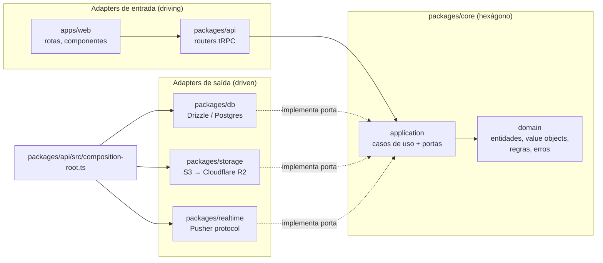
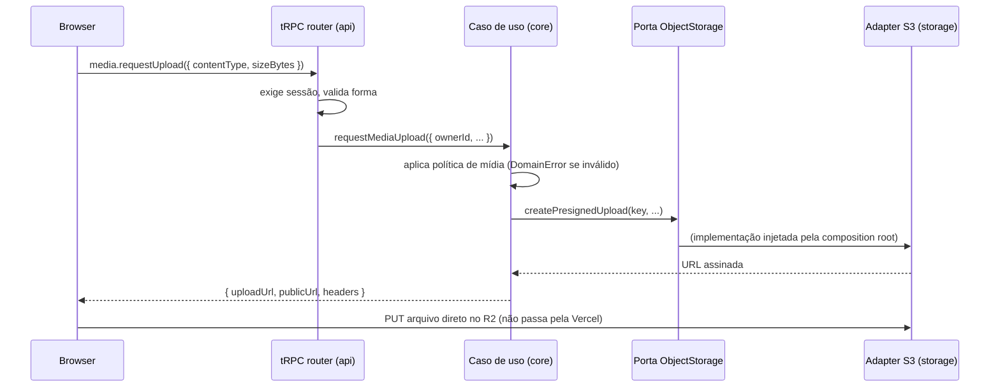

# Arquitetura do Quizio

> Decisão registrada em [ADR 0001](adr/0001-arquitetura-hexagonal-ddd.md). Este documento é o guia prático.

## Visão geral

O Quizio é um **monólito modular** organizado em **arquitetura hexagonal (ports & adapters)**, com **DDD tático** no núcleo e desenvolvimento **test-first (TDD)**. Tudo roda dentro de um único app TanStack Start (hoje na Vercel), mas o código de negócio não sabe disso: provedores de infraestrutura (banco, storage, real-time, e futuramente e-mail e IA) ficam atrás de **portas** e podem ser trocados alterando apenas um **adapter** e a **composition root**.



## Pacotes e regra de dependência

| Pacote | Papel hexagonal | Pode importar |
| --- | --- | --- |
| `packages/core` | Domínio + aplicação (casos de uso, portas, fakes de teste) | **Nada** além de si mesmo. Sem `drizzle`, `pusher`, `@aws-sdk`, `react`, `zod`, env. |
| `packages/db` | Adapter de saída: schema Drizzle, repositórios | `core`, `env` |
| `packages/storage` | Adapter de saída: `ObjectStorage` via S3 (R2) | `core` |
| `packages/realtime` | Adapter de saída (`RealtimePublisher`) e porta/adapter do cliente (`RealtimeSubscriber`) | `core` |
| `packages/auth` | Subdomínio genérico (Better Auth) | `db`, `env` |
| `packages/api` | Adapter de entrada (tRPC) + **composition root** | todos os anteriores |
| `packages/ui` | Design system (sem regra de negócio) | — |
| `apps/web` | Adapter de entrada (UI, rotas server) | `api` (tipos + handler), `ui`, `realtime` (cliente), `env` |

Regras:

1. **O domínio não conhece infraestrutura.** Se um arquivo em `packages/core` precisa de algo externo, crie uma porta (interface) em `application/ports` e implemente o adapter fora do core.
2. **Adapters não contêm regra de negócio.** Eles traduzem (linha do banco ↔ entidade, evento de domínio ↔ mensagem Pusher). Validação de negócio fica no core.
3. **Só a composition root conhece implementações concretas.** `packages/api/src/composition-root.ts` lê o env e instancia adapters; `container.ts` liga casos de uso às portas sem tocar em env — por isso testes montam o container com fakes.
4. **Routers tRPC são finos.** Validam a *forma* da entrada (zod), extraem a identidade da sessão e chamam um caso de uso. Nada de `db.select` dentro de router.

## Bounded contexts

| Contexto | Pasta no core | Responsabilidade | Referência Kahoot |
| --- | --- | --- | --- |
| **Quiz** (autoria) | `core/src/quiz` | Kahoot/quiz, perguntas e seus tipos, alternativas, tempo, pontos, validação de publicação | Editor |
| **Game** (partida ao vivo) | `core/src/game` | Sessão, PIN, lobby, jogadores, ciclo de vida da pergunta, respostas, pontuação, streak, placar, pódio | Organizar ao vivo |
| **Library** | `core/src/library` | Pastas, favoritos, rascunhos, compartilhamento, lixeira, descoberta | Biblioteca |
| **Reports** | `core/src/reports` | Resultados consolidados por partida/jogador/pergunta | Relatórios |
| **Media** | `core/src/media` | Política de mídia, upload direto ao storage | Imagens/fundos |
| **Identity** | — (Better Auth) | Contas e sessões; o core recebe apenas `ownerId`/`userId` | Conta |

Contextos se comunicam por **IDs** e por **casos de uso**, nunca importando entidades uns dos outros. Ex.: o Game recebe um *snapshot* do quiz no início da partida (a partida não muda se o quiz for editado depois — igual ao Kahoot).

`core/src/shared` é o *shared kernel*: `DomainError`, portas transversais (`Clock`, `IdGenerator`, `ObjectStorage`, `RealtimePublisher`) e seus fakes.

## Estrutura de um contexto

```
packages/core/src/<contexto>/
  domain/                 # puro: entidades, value objects, serviços de domínio, erros
    scoring.ts
    scoring.test.ts       # teste ao lado do código
  application/
    ports/                # interfaces que o contexto exige (ex.: QuizRepository)
    <caso-de-uso>.ts
    <caso-de-uso>.test.ts # usa fakes em memória
  testing/                # fakes das portas próprias do contexto
```

## Convenções de código

- **Caso de uso** = função fábrica que recebe dependências e devolve a operação:
  `createRequestMediaUpload({ storage, ids })` → `(input) => Promise<output>`. Tipo exportado `RequestMediaUpload`.
- **Erros de negócio** estendem `DomainError` e têm `code` estável no formato `CONTEXTO.MOTIVO` (`MEDIA.UNSUPPORTED_TYPE`). O middleware do tRPC converte qualquer `DomainError` em `BAD_REQUEST` e expõe `data.domainCode` ao cliente; qualquer outro erro vira 500.
- **Portas** são interfaces TypeScript nomeadas pelo que o domínio precisa (`ObjectStorage`), não pela tecnologia.
- **Adapters** são nomeados `<tecnologia>-<porta>.ts` (`s3-object-storage.ts`, `pusher-realtime-publisher.ts`, futuramente `drizzle-quiz-repository.ts`) e expostos por uma fábrica `create…(config)` que recebe configuração explícita (nunca lê env).
- **Fakes** (`InMemoryObjectStorage`, `FixedClock`…) moram no pacote que define a porta, em `testing/`, e são a forma padrão de isolar testes — preferidos a `vi.fn()`.
- **Schema do banco** por contexto em `packages/db/src/schema/<contexto>.ts`; repositórios em `packages/db/src/repositories/<contexto>/`. Repositórios recebem o tipo `Database` (`packages/db/src/types.ts`), que funciona com node-postgres e PGlite.

## Fluxo de uma requisição



## Real-time em ambiente serverless

A Vercel não mantém WebSockets nem processos vivos entre requisições. Por isso ([ADR 0002](adr/0002-realtime-pusher-protocol.md)):

- **O servidor é autoritativo e sem estado em memória.** O estado da partida (pergunta atual, instante de abertura, respostas) fica no Postgres. Tempo de resposta = `recebidoEm − perguntaAbertaEm`, ambos medidos no servidor; o cliente nunca informa quanto tempo levou.
- **Clientes nunca publicam.** Jogador responde via mutation tRPC → caso de uso grava e calcula → `RealtimePublisher` notifica host e jogadores.
- **Sem timers no servidor.** O prazo da pergunta é derivado de `perguntaAbertaEm + limite`. A tela do host dispara a transição ("tempo esgotado", "próxima"), e o servidor valida que a transição é permitida (idempotente). Respostas após o prazo (com pequena tolerância de latência definida na spec do jogo) são rejeitadas.
- **Canais** seguem o padrão `game-{gameId}` (broadcast da partida) e, quando houver dados individuais, canais privados por jogador autorizados por um endpoint próprio — a ser definido na spec da partida ao vivo.

Se o deploy mudar para um host com processos persistentes (VPS, Fly) ou para Cloudflare (Durable Objects), apenas os adapters de real-time e a composition root mudam.

## Como trocar um provedor

1. Crie o adapter implementando a porta existente (ex.: `ably-realtime-publisher.ts`).
2. Escreva o teste de integração do adapter (`*.int.test.ts`) contra o serviço real ou emulador.
3. Troque a instância em `composition-root.ts` (e `apps/web/src/lib/realtime-subscriber.ts` no cliente) e as variáveis em `packages/env`.
4. Casos de uso, routers e componentes não mudam — se precisarem mudar, a porta estava vazando detalhes do provedor e deve ser corrigida.
