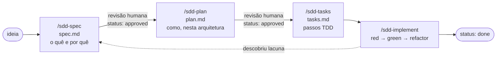

# Specs — Spec-Driven Development no Quizio

> Por que este fluxo: [ADR 0006](../docs/adr/0006-spec-driven-development.md). Regras inegociáveis: [constituição](constitution.md).

Nenhuma funcionalidade é implementada sem uma spec aprovada. As specs são a fonte de contexto para humanos e para a IA, e continuam válidas depois da entrega como documentação viva.

## Fluxo



| Etapa | Comando | Artefato | Conteúdo | Não contém |
| --- | --- | --- | --- | --- |
| 1. Especificar | `/sdd-spec <ideia>` | `features/NNN-slug/spec.md` | Problema, histórias, regras de negócio, critérios de aceite (Dado/Quando/Então), fora de escopo, perguntas em aberto | Tecnologia, tabelas, componentes |
| 2. Planejar | `/sdd-plan NNN` | `features/NNN-slug/plan.md` | Contextos, entidades, casos de uso, portas, schema, procedures tRPC, eventos real-time, UI, testes por camada | Código |
| 3. Quebrar | `/sdd-tasks NNN` | `features/NNN-slug/tasks.md` | Checklist ordenado de dentro para fora (domínio → aplicação → adapters → API → UI → E2E), cada item com o teste que vem primeiro | — |
| 4. Implementar | `/sdd-implement NNN [Txx]` | código + testes | Execução TDD, marcando as tarefas | Mudanças fora do escopo da spec |

## Estrutura

```
specs/
  README.md             este guia
  constitution.md       princípios inegociáveis
  glossary.md           linguagem ubíqua PT ↔ EN
  roadmap.md            ordem das features e status
  product/
    kahoot-reference.md referência funcional do Kahoot (fonte das regras)
  templates/            modelos usados pelos comandos
    spec.md  plan.md  tasks.md
  features/
    001-slug/
      spec.md  plan.md  tasks.md
```

## Status

| Arquivo | Valores | Quem muda |
| --- | --- | --- |
| `spec.md` | `draft` → `approved` → `planned` → `in-progress` → `done` | `approved` só por decisão humana |
| `plan.md` | `draft` → `approved` | `approved` só por decisão humana |
| `tasks.md` | `todo` → `in-progress` → `done` | `/sdd-implement` |

## Regras de escrita

- **Idioma**: specs em PT-BR; termos de domínio com o nome em inglês usado no código na primeira ocorrência, ex.: "PIN do jogo (`GamePin`)". Novos termos entram no [glossário](glossary.md).
- **Toda regra de negócio tem fonte**: seção da `kahoot-reference.md` ou "decisão do produto". Itens marcados "(não confirmado)" na referência viram *perguntas em aberto* até alguém decidir.
- **Critérios de aceite são testáveis** e numerados (`CA-01`); o plano aponta qual teste cobre cada um.
- **Mudou o comportamento depois de entregue?** Atualize a spec existente e registre no *Changelog* dela, ou crie uma nova feature que a referencie.
